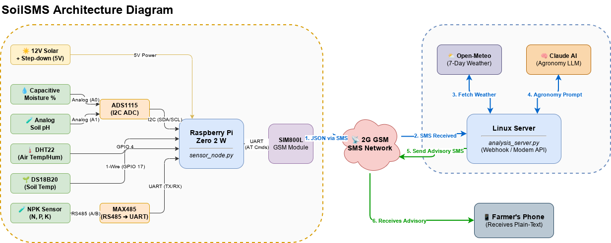
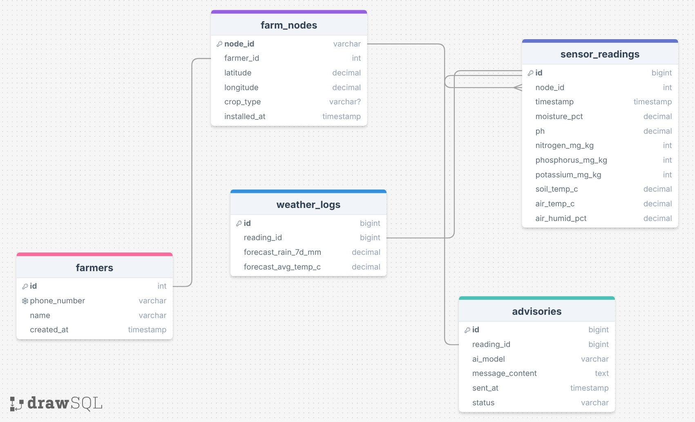

# SoilSMS

SMS-based soil monitoring and crop advisory system for rural Tanzania.  
No internet required on the farm. Works on **2G GSM**.

[Uitleg/explanation](context.md)

# System Overview

## LOGS
 

[drawSQL](https://drawsql.app/teams/school-470/diagrams/soilsms)

| DUTCH               | ENGLISH             |
| ------------------- | ------------------- |
| [LOGS](LOGS/uitleg.md) | [LOGS](LOGS/README.md) |

## Two-Component System

### sensor_node.py (runs on RPi)

Reads **5 sensor types** via:
- I2C (ADS1115 ADC)
- 1-Wire (DS18B20)
- UART Modbus (NPK Sensor)
- GPIO (DHT22)

Then:
1. Serializes readings into **compact JSON**
2. Sends data as an **SMS using AT commands**
3. Loops every hour

### analysis_server.py (runs on any Linux server)

1. Receives SMS
2. Parses JSON data
3. Fetches **7-day weather forecast** from **Open-Meteo** (no API key required)
4. Sends both datasets to **Claude** with a Tanzania-specific agronomy prompt
5. Converts the result into **plain readable advice**
6. Sends SMS reply back to the farmer

### FastAPI Logging API (new)

1. Receives and stores **sensor data**, **weather logs**, and **AI advisories**
2. Provides a **RESTful interface** for data retrieval and historical analysis
3. Uses **SQLAlchemy** for database interactions with PostgreSQL

Supports two modes:
- **Local GSM modem** (polling mode)
- **Africa’s Talking API** (webhook mode)

---

# Architecture
```
[Farm / RPi Node]                        [Server]
  Sensors ──► sensor_node.py             analysis_server.py
              └─ Reads soil data              ├─ Parses SMS JSON
              └─ JSON via SMS ──────────────► ├─ Fetches weather (Open-Meteo)
                                              ├─ Analyses with Claude
                                              └─ Replies to farmer via SMS
                                                      │
                                               [Farmer's phone]
                                               Receives plain-text
                                               crop advisory
```

---

# Hardware (RPi Node)

| Component | Model | Purpose |
|---|---|---|
| Microcontroller | Raspberry Pi Zero 2 W | Main controller |
| Moisture sensor | Capacitive (3.3V) | Soil moisture % |
| ADC | ADS1115 (I2C) | Reads moisture + pH analog |
| pH sensor | Analog pH probe + module | Soil pH |
| Air temp/humidity | DHT22 | Air conditions |
| Soil temperature | DS18B20 (1-Wire) | Soil temp |
| NPK sensor | RS485 Modbus RTU (e.g. JXBS-3001) | Nitrogen, Phosphorus, Potassium |
| GSM module | SIM800L or SIM7600 | SMS communication |
| Power | 12V solar + step-down to 5V | Off-grid power |
| SIM card | Any Tanzanian carrier (Vodacom, Airtel) | 2G SMS |

---

# Wiring

### ADS1115 (I2C)
```
ADS1115 VDD  → RPi 3.3V
ADS1115 GND  → RPi GND
ADS1115 SCL  → RPi GPIO 3 (SCL)
ADS1115 SDA  → RPi GPIO 2 (SDA)
ADS1115 A0   → Moisture sensor output
ADS1115 A1   → pH sensor output
```

### DHT22
```
DHT22 VCC → RPi 3.3V
DHT22 GND → RPi GND
DHT22 DAT → RPi GPIO 4
```

### DS18B20 (1-Wire)
```
DS18B20 VCC → RPi 3.3V
DS18B20 GND → RPi GND
DS18B20 DAT → RPi GPIO 17 (with 4.7k pull-up to 3.3V)
```
Enable 1-Wire in `/boot/config.txt`:
```
dtoverlay=w1-gpio,gpiopin=17
```

### NPK Sensor (RS485 → UART via MAX485 module)
```
MAX485 VCC → RPi 5V
MAX485 GND → RPi GND
MAX485 RO  → RPi GPIO 15 (RXD0, /dev/ttyS0)
MAX485 DI  → RPi GPIO 14 (TXD0)
MAX485 DE + RE → RPi GPIO 18 (tied together, drive HIGH to transmit)
MAX485 A/B → NPK sensor RS485 A/B terminals
```

### SIM800L GSM
```
SIM800L VCC → 4.2V (needs 2A capable supply)
SIM800L GND → RPi GND (shared)
SIM800L TXD → RPi GPIO 15 (RXD, /dev/ttyAMA0)
SIM800L RXD → RPi GPIO 14 (TXD) via 1k/2k voltage divider (5V→3.3V)
```

---

# Setup & Deployment

### RPi Node Setup
```bash
# Enable I2C + 1-Wire
sudo raspi-config # Interface Options → I2C/1-Wire → Enable

# Install Python deps
pip install adafruit-circuitpython-ads1x15 adafruit-circuitpython-dht w1thermsensor pyserial minimalmodbus

# Deploy service
sudo cp soilsms-node.service /etc/systemd/system/
sudo systemctl daemon-reload
sudo systemctl enable soilsms-node
sudo systemctl start soilsms-node
```

### Server Setup
```bash
# Install deps
pip install flask requests anthropic pyserial

# Configure
cp .env.example .env
nano .env  # Fill in your values (Claude API key, phone numbers, etc.)

# Deploy service
sudo cp soilsms-server.service /etc/systemd/system/
sudo systemctl daemon-reload
sudo systemctl enable soilsms-server
sudo systemctl start soilsms-server
```

---

# Calibration

### Moisture sensor
1. Dip sensor in dry air → record voltage → set `MOISTURE_VOLT_DRY` in `sensor_node.py`
2. Submerge in water → record voltage → set `MOISTURE_VOLT_WET`

### pH sensor
1. Dip in pH 4 buffer → record voltage → set `PH_VOLT_PH4`
2. Dip in pH 7 buffer → record voltage → set `PH_VOLT_PH7`

---

# Example SMS Output

**From node to server (raw JSON):**
```
{"node_id":"FARM001","timestamp":1718000000,"moisture_pct":34.2,"ph":6.1,"soil_temp_c":24.5,"air_temp_c":28.0,"air_humid_pct":72.0,"nitrogen_mg_kg":85,"phosphorus_mg_kg":30,"potassium_mg_kg":160}
```

**From server to farmer (plain text crop advisory):**
```
SoilSMS 12/06 08:42 UTC
STATUS: Soil is dry (34%) and slightly acidic (pH 6.1).
NUTRIENTS: Nitrogen is low (85 mg/kg). Phosphorus and potassium are adequate.
ACTION: Add nitrogen fertilizer before next rain. Do not irrigate this week as rain is expected.
PLANT: Best suited for maize or beans.
TIMING: Plant in 5-7 days after forecasted rain.
```

---

# Troubleshooting

| Problem | Fix |
|---|---|
| NPK sensor reads 0 | Check RS485 wiring polarity (swap A/B) |
| DHT22 fails repeatedly | Add 10k pull-up on DAT pin |
| GSM modem won't send | Check SIM credit; verify baud rate |
| Claude returns error | Check `ANTHROPIC_API_KEY` in `.env` |

